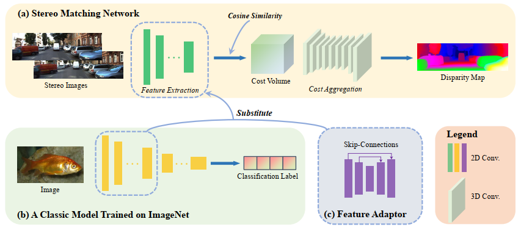

### GraftNet: Towards Domain Generalized Stereo Matching with a Broad-Spectrum and Task-Oriented Feature



#### Dependencies:
- Python 3.6
- PyTorch 1.7.0
- torchvision 0.3.0
- [VGG trained on ImageNet](https://download.pytorch.org/models/vgg16-397923af.pth)

#### Datasets:
- [SceneFlow](https://lmb.informatik.uni-freiburg.de/resources/datasets/SceneFlowDatasets.en.html)
- [KITTI stereo 2015](http://www.cvlibs.net/datasets/kitti/eval_scene_flow.php?benchmark=stereo)
- [KITTI stereo 2012](http://www.cvlibs.net/datasets/kitti/eval_stereo_flow.php?benchmark=stereo)
- [Middlebury v3](https://vision.middlebury.edu/stereo/submit3/)
- [ETH3D](https://www.eth3d.net/datasets#low-res-two-view)

#### Training Steps:
##### 1. Train A Basic Stereo Matching Network:
```bash
python train_baseline.py --data_path (your SceneFlow data folder)
```
##### 2. Graft VGG's Feature and Train the Feature Adaptor:
```bash
python train_adaptor.py --data_path (your SceneFlow data folder)
```
##### 3. Retrain the Cost Aggregation Module:
```bash
python retrain_CostAggregation.py --data_path (your SceneFlow data folder)
```

#### Evaluation:
##### Evaluate on KITTI:
```bash
python test_kitti.py --data_path (your KITTI training data folder) --load_path (the path of the final model)
```
##### Evaluate on Middlebury-H:
```bash
python test_middlebury.py --data_path (your Middlebury training data folder) --load_path (the path of the final model)
```
##### Evaluate on ETH3D:
```bash
python test_middlebury.py --data_path (your Middlebury training data folder) --load_path (the path of the final model)
```
